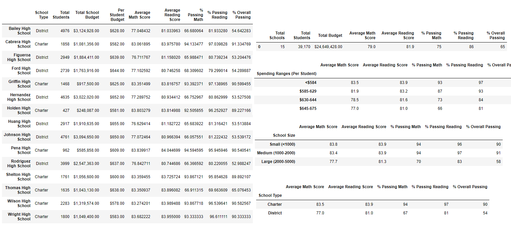

# School-District-Analysis

## Project Overview
In an effort to showcase trends in school performance and making decisions regarding budget allotments, a district school board  has given you the following tasks while giving you access to all the district schools data - math and reading scores for all students grade 9-12, and various information on schools budget and type.
1. Clean the data, and fix the students names
2. Generate the School District Summary (total budget, number students passing math and reading, average scores)
3. Generate the Scores Summary (number students passing, and average scores)
      - by schools - and find the hiughest and lowest performing schools
      - by Grades
      - by School spending per student
      - by Svhool Size
      - by Schoolo types

## Resources
- Data Source: schools_complete.csv, and students_complete.csv
- Software: Python 3.7.6, Anaconda 4.8.3, Jupyter Notebook, Pandas Library

## Summary
The board was provided with all the summaries by district, shcool, grades, spending, size, and types, while learning about the highest and lowest performing schools.

