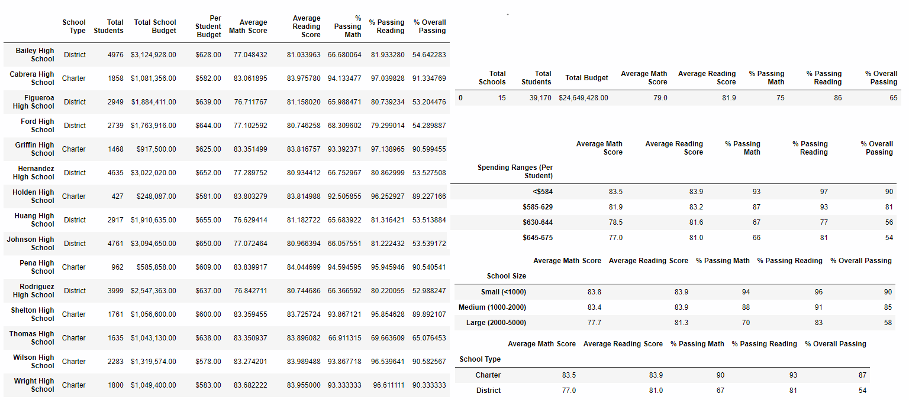

# School-District-Analysis

## Project Overview
In an effort to showcase trends in school performance and making decisions regarding budget allotments, a district school board  has given you the following tasks while giving you access to all the district schools data - math and reading scores for all students grade 9-12, and various information on schools budget and type.
1. Clean the data, and fix the students names
2. Generate the School District Summary (total budget, number students passing math and reading, average scores)
3. Generate the Scores Summary (number students passing, and average scores)
      - by schools - and find the hiughest and lowest performing schools
      - by Grades
      - by School spending per student
      - by School Size
      - by Schoolo types

## Resources
- Data Source: schools_complete.csv, and students_complete.csv
- Software: Python 3.7.6, Anaconda 4.8.3, Jupyter Notebook, Pandas Library

## Summary
The board was provided with all the summaries by district, shcool, grades, spending, size, and types, while learning about the highest and lowest performing schools.

## Challenge Overview
The school/student data was incorrect, you need to replace the math/reading scores for each student in 9th Grade at Thomas High School by NaN, and recalculate/generate all the summaries, and see how this change impacted them.

## Challenge Summary

- The District Summary hasn't been affected - as we formatted the averages and percentages, and there are far more students whose scores haven't changed.
- Obviously, in the School Summary, the Thomas High School row has been afftected. The averages for math and reading  are still very similar (and would have only changed a tenth if formnatted), but the percentages for passing have lowered by 30%. Thomas High School is not one of the 5 highest performing schools anymore, but the 5 lowest performing ones remain the same ones.
- In the Spending Summary, only the 630-644 bin has been affected as we se the passing percentages have all lowered by around 6-7%.
- In the Size Summary, only the medium (1000-2000) bin has been affected and the passing percentages lowered by 6%.
- In the Type Summary, only the Charter type has been affected and the passing percentages lowered by 3-4%
